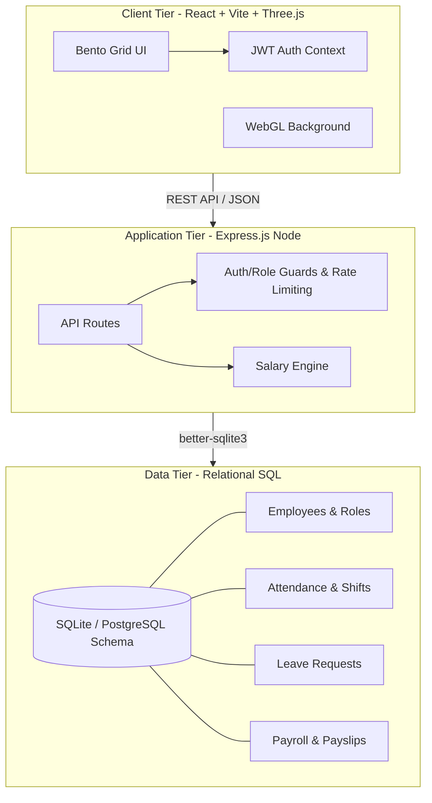

# Odoo HRMS Enterprise System
### Built by Soumoditya Das for Odoo Hackathon 2026


An enterprise-grade, standalone Human Resource Management System built from scratch, emphasizing **zero dependency on external backend-as-a-service platforms**, robust relational database design, and high performance.

## 🎯 The Social Problem & Vision
Modern startups and SMEs often rely on fragmented tools or expensive SaaS platforms (like Firebase/MongoDB Atlas) for HR management. This creates data silos, vendor lock-in, and compliance risks. 

**This project solves this by providing a self-reliant, highly scalable, and modular HRMS that companies can own entirely.** It uses a robust relational SQL database (SQLite configured for PostgreSQL compatibility), ensuring ACID compliance, data integrity, and local ownership.

---

## 🔐 Quick Start for Judges (Demo Credentials)
To quickly test the application, please use the following seeded accounts:

| Role | Email | Password |
| :--- | :--- | :--- |
| **Admin / HR Manager** | `soumoditya@hrms.in` | `admin@2026` |
| **Employee** | `priya.nair@hrms.in` | `password123` |

---

## 🏗️ System Architecture & Tech Stack

*   **Frontend**: React.js (Vite), Pure CSS (Bento Grid UI), Three.js (Interactive Login Canvas).
*   **Backend**: Node.js, Express.js.
*   **Database**: SQLite (via `better-sqlite3` for zero-setup local dev) with a **PostgreSQL-compatible relational schema**. 
*   **Authentication**: JWT (JSON Web Tokens) with strict Role-Based Access Control (RBAC).

### Key Architectural Decisions:
1.  **Relational SQL over NoSQL**: HR data is inherently relational (Employees belong to Departments, have Shifts, generate Attendance, and receive Payslips). A strict SQL schema ensures data integrity and complex querying capabilities.
2.  **Integer Micro-Cents for Financials**: All salary and payroll calculations are done in integer micro-cents (multiplying by 1,000,000) to absolutely eliminate floating-point arithmetic errors.
3.  **Graceful Degradation**: The API server includes an in-memory fallback store if the SQLite database fails to initialize, ensuring the application remains testable in restricted environments.

### 🏛️ 3D System Architecture Diagram


## 💾 Database Schema Design (PostgreSQL / SQLite)

The system relies on a meticulously normalized relational schema.

*   `departments`: Organizational units.
*   `roles`: Job titles and hierarchy levels.
*   `employees`: Core user data, hashed passwords, base wages (micro-cents), portal access levels.
*   `shifts` & `shift_roster`: Time management and scheduling.
*   `attendance`: Daily clock-in/out tracking with calculated work minutes.
*   `leave_types` & `leave_requests`: Paid/Unpaid time off management.
*   `payroll_runs` & `payslips`: Monthly salary generation with automated tax and deduction calculations.
*   `tickets` & `notices`: Internal communication and IT support.
*   `audit_log`: Tracking critical system actions for security and compliance.

## ✨ Features

*   **Beautiful UI/UX**: Clean, intuitive interface inspired by modern CRM aesthetics, featuring a responsive sidebar, KPI dashboards, and data tables.
*   **Role-Based Access**: Distinct portals and permissions for Admin, HR, and Employees.
*   **Live Attendance Tracking**: Real-time clock-in/clock-out system with active session duration timer.
*   **Comprehensive HR Modules**: 
    *   Employee Directory
    *   Leave Management (Apply, Approve/Reject)
    *   Payroll & Payslips
    *   Corporate Notice Board
    *   Support Ticketing System
*   **Robust Input Validation**: Graceful error handling and input sanitization on the backend.
*   **Security**: Bcrypt password hashing, JWT authorization, Express Rate Limiting.

## 🚀 Running Locally

1.  **Install Dependencies**:
    ```bash
    npm install
    ```
2.  **Seed the Database** (Generates realistic Indian demo data, attendance, and payroll):
    ```bash
    node server/db/seed.js
    ```
3.  **Start the Application** (Runs both Vite frontend and Express API concurrently):
    ```bash
    npm run dev
    ```
    *   Frontend: `http://localhost:3000`
    *   Backend API: `http://localhost:3001`
