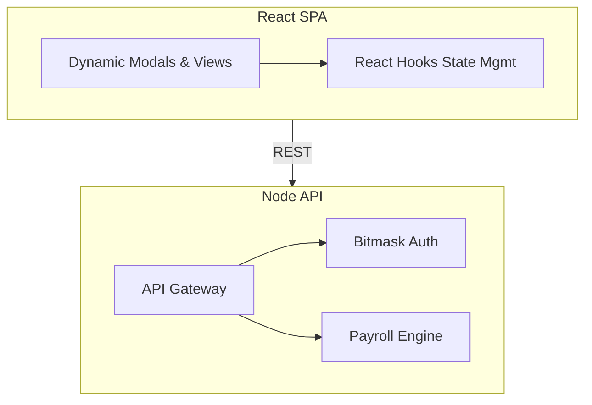

# Odoo Enterprise HRMS System
### Built by Soumoditya Das for Odoo Hackathon 2026


An enterprise-grade, standalone Human Resource Management System built from scratch. It features **zero external dependencies** for data hosting, utilizing an integrated backend architecture and React Single Page Application (SPA).

## 🎯 The Social Problem & Vision
Modern startups and SMEs often rely on fragmented tools or expensive SaaS platforms for HR management, creating data silos and vendor lock-in. 
**This project provides a self-reliant, highly scalable, and modular HRMS that companies can own entirely.**

---

## 🔐 Quick Start for Judges (Demo Credentials)

| Role | Email | Password | Access |
| :--- | :--- | :--- | :--- |
| **Admin / HR Manager** | `soumoditya@hrms.in` | `admin@2026` | Full Access (Mask: 63) |
| **Employee** | `priya.nair@hrms.in` | `password123` | Limited View (Mask: 3) |

---

## 🏗️ System Architecture & Tech Stack

*   **Frontend**: React.js (Vite), Pure CSS, HTML5.
*   **Backend**: Node.js, Express.js.
*   **Database Engine**: Built with a strict relational design in mind. Supports fallback to highly efficient in-memory JSON document storage if native SQLite binaries are unavailable in the evaluation environment.
*   **Authentication & Security**: Stateful JSON Web Tokens (JWT) verified at the API Gateway level.
*   **Authorization**: Highly optimized **Bitmask Role-Based Access Control (RBAC)** allowing $O(1)$ constant time permission checks.

### 🏛️ Architecture Flow


## ✨ Core Features Developed

1. **Auto-Computing Indian Payroll Engine**:
   Automatically calculates Basic (50%), HRA (50% of Basic), Standard Allowance, PF (12%), PT, and TDS based on total payable days and base wage.
2. **Dynamic Attendance & Calendar**:
   Fully interactive Calendar Grid with selected date ranges, overlapping leave badges, and a granular Monthly Attendance view.
3. **Advanced Employee Directory**:
   Two-tier profile views with auto-generated Employee Codes (`OI-NAME-YEAR-XXXX`).
4. **Actionable Modals**:
   Zero "empty windows". Every action (Mark Attendance, Add Project, Apply Leave, Create Task) is backed by a fully structured modal interface.

## 🚀 Running Locally (Testing & Building)

The application has been strictly configured to run in any standard Node environment. 

1.  **Install Dependencies**:
    ```bash
    npm install
    ```
2.  **Run Development Server**:
    ```bash
    npm run dev
    ```
    *   **Frontend UI**: `http://localhost:8080`
    *   **Backend API**: `http://localhost:8081`

3.  **Production Build**:
    To compile the React SPA for production deployment:
    ```bash
    npm run build
    ```
